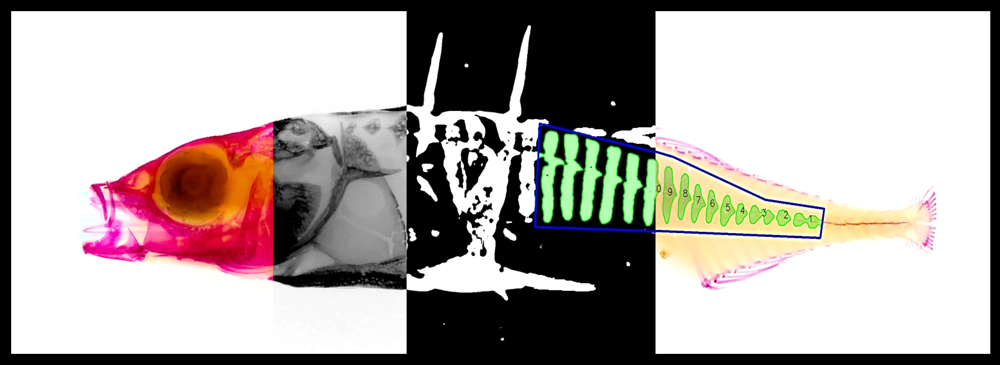

.. raw:: html

	

	

	
 
	

.. raw:: html
  
	

			
		
 
			<h-new>phenopype</h-new>
			<p-new>A phenotyping pipeline for Python</p-new>
		

	
	

	
	

	
|

Welcome to the phenopype documentation!

|

This site contains installation instructions, an autogenerated API-reference, links to tutorials and more resources revolving around Python and computer vision. If something is unclear, if you find a mistake, or if you have ideas for improving the docs, please `raise an issue <https://github.com/phenopype/phenopype/issues>`_ in the phenopype github repository. 

|

.. grid:: 2
	:gutter: 3
	

	.. grid-item::

		.. card::  Quickstart
			:link: quickstart.html

			Getting started with phenopype 
		
	.. grid-item::

		.. card::  Installation
			:link: installation/index.html

			Detailed installation instructions

	.. grid-item::

		.. card::  API reference
			:link: api/index.html

			All functions and classes explained
			
	.. grid-item::

		.. card::  Tutorials
			:link: tutorials/index.html

			Step by step feature demonstration 
		
	.. grid-item::

		.. card::  Resources
			:link: resources/index.html

			Information on OpenCV, Python, etc.
						
	.. grid-item::

		.. card::  Citation
			:link: citation.html
			
			How to cite phenopype

.. toctree::
	:maxdepth: 1
	:hidden: 
	:caption: Internal links
	
	quickstart
	installation/index
	api/index
	tutorials/index
	resources/index
	citation

